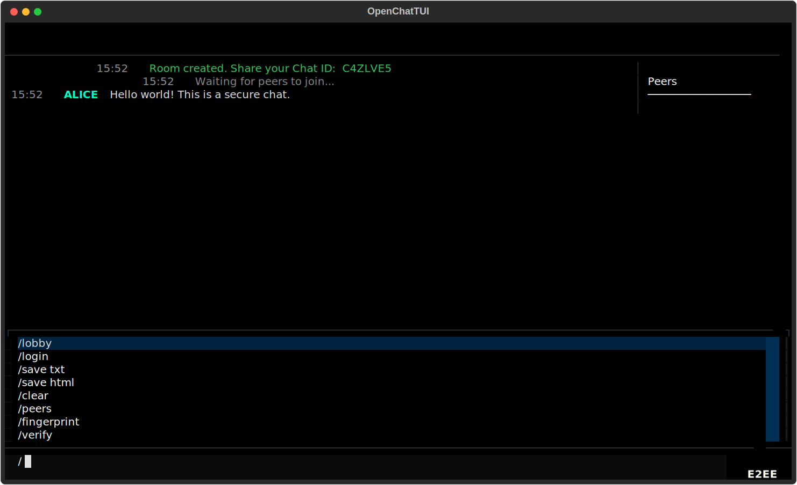

<div align="center">

# OpenChatTUI

**Encrypted peer-to-peer terminal chat.**
No servers. No logs. No traces.

[🌐 View Landing Page](https://singharindam.github.io/OpenChatTUI/)

`AES-256-GCM` · `X25519 ECDH` · `Ed25519` · `Zero Footprint`

---



</div>

## Quick Start

First, clone the repository:
```bash
git clone https://github.com/SinghArindam/OpenChatTUI.git
cd OpenChatTUI
```

### Option A: Using `uv run` (Recommended, Sandbox)
If you don't have [`uv`](https://github.com/astral-sh/uv) installed, install it:
```bash
# macOS/Linux
curl -LsSf https://astral.sh/uv/install.sh | sh
# Windows
powershell -ExecutionPolicy ByPass -c "irm https://astral.sh/uv/install.ps1 | iex"
```

Then launch the app:
```bash
uv run openchat.py
```
This reads the inline PEP 723 metadata, configures a temporary environment, and launches the app without affecting your host Python setup.

### Option B: Standard Python (Auto-installer)
Alternatively, execute:
```bash
python openchat.py
```
The script will check for missing packages, automatically install them (using `uv` if present, otherwise falling back to standard `pip`), and hot-reload itself.

### Option C: Manual Virtual Environment (Standard venv + pip)
If you prefer to manage the environment and dependencies manually:
```bash
python -m venv .venv
# On macOS/Linux: source .venv/bin/activate
# On Windows (PowerShell): .venv\Scripts\Activate.ps1
.venv\Scripts\activate
pip install -r requirements.txt
python openchat.py
```
This isolates the dependencies within a local virtual environment folder.


## How It Works

1. **Launch** — Pick a username and color
2. **Create or Join** — Host a room or join one with a 7-character Chat ID
3. **Chat** — Messages are end-to-end encrypted, directly peer-to-peer
4. **Exit** — All data is securely wiped from memory

No central server. No database. No temp files. Everything lives in RAM and dies when you close the app.

## What's New

- **Smart Commands**: Type `/` for instant autocomplete.
- **Safe Exit**: Press `Esc` for an exit menu, or `Ctrl+Q` for an emergency wipe.
- **AMOLED Theme**: High-contrast black background with bright white, peach, and gold UI accents.

## Security Model

| Layer | Primitive | What It Does |
|---|---|---|
| Key Exchange | X25519 ECDH | Ephemeral shared secret, never transmitted |
| Encryption | AES-256-GCM | Authenticated encryption on every message |
| Signatures | Ed25519 | Prevents man-in-the-middle attacks |
| Key Derivation | HKDF-SHA256 | Unique keys per peer pair, per direction |
| Forward Secrecy | Ephemeral keys | Fresh keypairs every session |
| Data Lifecycle | RAM-only | Secure memory wipe on exit |

Verify peer identity out-of-band using `/fingerprint` and `/verify`.

## Commands

| Command | Description |
|---|---|
| `/join <ID>` | Connect to a peer by Chat ID |
| `/connect <IP:PORT>` | Direct connection by address |
| `/lobby` | Disconnect and return to the lobby screen |
| `/login` | Disconnect and return to the login screen |
| `/save txt` | Export chat as plaintext file |
| `/save html` | Export chat as styled HTML file |
| `/clear` | Clear the screen (history preserved) |
| `/peers` | List connected peers with IDs |
| `/fingerprint` | Show your Ed25519 fingerprint |
| `/verify <ID>` | Show a peer's fingerprint |
| `/help` | List all commands |
| `/exit` | Secure wipe and quit |

## Architecture

```
     Alice ←─── E2EE ───→ Bob
       ↑                    ↑
       └──── E2EE ──────────┘
               Charlie
```

**Full-mesh topology.** Every peer connects directly to every other peer over encrypted TCP. UDP broadcast handles automatic discovery on the local network. When a new peer joins, the existing peers share their peer list — the newcomer automatically connects to everyone, forming the full mesh.

## Network Discovery

Peers find each other via UDP broadcast on port `50001`. When you create a room, your node announces itself. When you join, your node queries for the target Chat ID. Both multicast (`239.0.0.1`) and broadcast (`255.255.255.255`) are used for maximum compatibility.

For peers on different networks, use `/connect <IP:PORT>` for direct TCP connection.

## Requirements

- Python 3.10+
- [`textual`](https://github.com/Textualize/textual) — Terminal UI framework
- [`cryptography`](https://github.com/pyca/cryptography) — OpenSSL-backed crypto primitives

## Project Structure

```
OpenChatTUI/
├── openchat.py              # Entire application (single file)
├── requirements.txt         # Dependencies
├── docs/
│   └── IMPLEMENTATION_PLAN.md   # Detailed technical design
└── README.md
```

## License

[MIT](LICENSE)
