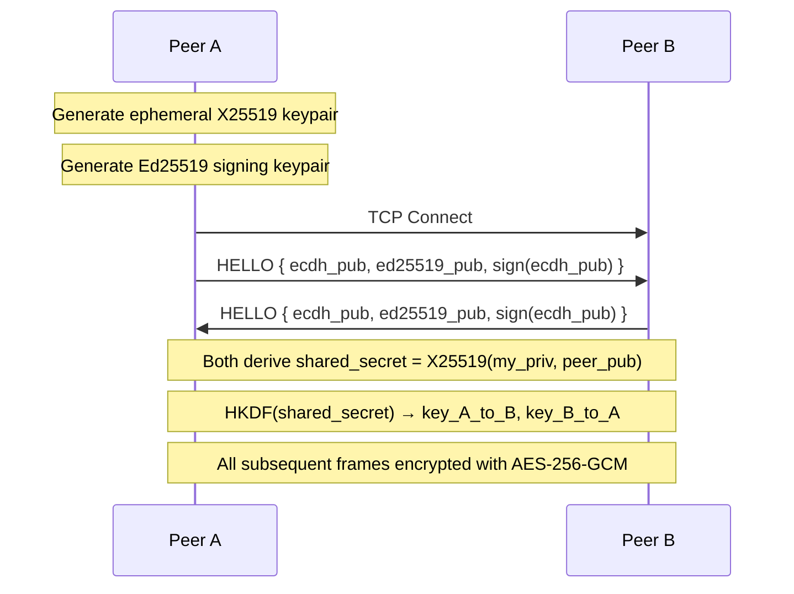

# Implementation Plan — OpenChatTUI (Full Audit & Redesign)

## 1. Vision

`OpenChatTUI` is a zero-footprint, military-grade encrypted, decentralized P2P terminal chat application. It combines the security posture of the Signal Protocol with the aesthetic polish of a premium dark-mode terminal UI. No servers. No logs. No traces.

---

## 2. Security Architecture

> [!CAUTION]
> Every byte that leaves a node's NIC is encrypted. Plaintext never touches the wire.

### 2.1 Cryptographic Primitives

| Layer | Primitive | Purpose |
|---|---|---|
| Key Exchange | **X25519 ECDH** | Ephemeral per-session Diffie-Hellman. Generates a shared secret between two peers without transmitting it. |
| Key Derivation | **HKDF-SHA256** | Stretches the raw ECDH shared secret into two 32-byte symmetric keys (one for each direction) using unique `info` context strings. |
| Symmetric Encryption | **AES-256-GCM** | Authenticated Encryption with Associated Data. Every message is encrypted *and* integrity-checked. Tampered ciphertext raises `InvalidTag`. |
| Digital Signatures | **Ed25519** | Each node signs its ECDH public key during handshake. Prevents Man-in-the-Middle attacks. Peers can optionally verify fingerprints out-of-band. |
| Nonce Strategy | **Counter-based + Random prefix** | 12-byte nonce = `4-byte random session prefix` + `8-byte monotonic counter`. Guarantees uniqueness even across sessions sharing the same key. |

### 2.2 Key Lifecycle & Forward Secrecy



- **Ephemeral keys**: Generated fresh every time the app launches. Old keys never exist on disk.
- **Per-peer keys**: Each peer-to-peer link has its own unique derived key pair. Compromising one link does not compromise others.
- **Memory zeroing**: On `/exit`, all key material, message buffers, and peer data are overwritten with random bytes via `ctypes.memset` before process termination.

### 2.3 What This Protects Against

| Threat | Mitigation |
|---|---|
| Passive eavesdropping (packet sniffing) | AES-256-GCM encryption on all TCP traffic |
| Man-in-the-Middle | Ed25519 signatures on ECDH public keys; optional fingerprint verification |
| Replay attacks | Counter-based nonces; duplicate nonce rejection |
| Message tampering | GCM authentication tag; `InvalidTag` on any modification |
| Key compromise (past sessions) | Ephemeral keys per session = perfect forward secrecy |
| Forensic recovery after exit | RAM-only storage; `ctypes.memset` zeroing on shutdown |
| Traffic analysis (who talks to whom) | UDP discovery is LAN-only broadcast; TCP connections are direct P2P |

### 2.4 Library

All crypto uses the `cryptography` library (v48.0.0, already installed) — the same library used by major Python projects, OpenSSL-backed, FIPS-validated primitives.

---

## 3. Networking Architecture

### 3.1 Node Topology: Full Mesh

Every peer is both a **TCP server** (listener) and a **TCP client** (initiator). When N peers are in a room, there are `N*(N-1)/2` direct encrypted TCP connections.

```
    Alice ←——→ Bob
      ↑  ╲      ↑
      |    ╲     |
      |     ╲    |
      ↓      ╲→  ↓
   Charlie ←——→ Dave
```

### 3.2 TCP Server

- Binds to `0.0.0.0` on a random available port (OS-assigned via `port=0`).
- Accepts incoming connections and initiates the encrypted handshake.
- Uses `asyncio` streams (`asyncio.start_server`) for non-blocking I/O.

### 3.3 UDP Discovery Engine

- **Port**: `50001` (with `SO_REUSEADDR` + `SO_REUSEPORT` where supported).
- **Multicast Group**: `239.0.0.1` (link-local scope, won't leak beyond the LAN).
- **Broadcast Fallback**: Also sends to `255.255.255.255` for networks that block multicast.

**Discovery Protocol (unencrypted, metadata only — no message content ever):**

| Packet Type | Payload | When Sent |
|---|---|---|
| `ANNOUNCE` | `{ chat_id, username, tcp_port, ed25519_fingerprint, color }` | Every 3 seconds while in a room |
| `QUERY` | `{ target_chat_id, requester_chat_id }` | When a user runs `/join <ID>` |
| `RESPONSE` | `{ chat_id, username, tcp_port, ip, ed25519_fingerprint, color }` | In reply to a matching `QUERY` |

> [!NOTE]
> UDP discovery packets contain **only** connection metadata (IP, port, fingerprint). They never contain message content. The Chat ID is a room identifier, not a secret — anyone on the LAN can see which rooms exist, but they cannot read the encrypted messages without joining and completing the ECDH handshake.

### 3.4 Chat ID Generation

```python
seed = os.urandom(16)
raw  = hashlib.sha256((username + seed.hex()).encode()).digest()
chat_id = base64.b32encode(raw)[:7].decode()  # e.g., "K7X9R2W"
```

- 7 characters, A-Z + 2-7, strictly uppercase.
- Unique per session (collision probability ≈ 1 in 34 billion).

### 3.5 Wire Protocol (over encrypted TCP)

After the ECDH handshake, all frames use this format:

```
┌──────────────┬────────────────────────────────────┐
│ 4-byte len   │  AES-256-GCM encrypted payload     │
│ (big-endian) │  (nonce‖ciphertext‖tag)             │
└──────────────┴────────────────────────────────────┘
```

Decrypted payload is JSON:

```json
{
  "type": "message|handshake|peer_list|join_notify|leave_notify|system",
  "username": "ALICE",
  "color": "#88C0D0",
  "chat_id": "K7X9R2W",
  "content": "Hello!",
  "timestamp": 1750500000.0,
  "peers": [{"ip": "...", "port": ..., "chat_id": "...", "fingerprint": "..."}]
}
```

### 3.6 Full-Mesh Connection Flow

1. **Alice creates a room** → TCP server starts, UDP announces begin.
2. **Bob joins** → Sends UDP `QUERY` for Alice's Chat ID → Receives `RESPONSE` → TCP connect to Alice → Encrypted handshake → Both exchange peer lists (empty at this point).
3. **Charlie joins** → Sends UDP `QUERY` for Alice's (or Bob's) Chat ID → TCP connect → Handshake → Receives peer list containing Bob → Charlie directly connects to Bob as well.
4. **Duplicate prevention**: If `my_chat_id < peer_chat_id`, I initiate; otherwise I wait for them. This prevents two peers from opening parallel connections to each other.

---

## 4. TUI Design — "Best in the World"

### 4.1 Technology

- **Framework**: `Textual` (latest, pip-installed) with external `.tcss` stylesheet.
- **Theme**: Custom **Nord-inspired dark theme** with hand-picked accent colors.
- **Typography**: Unicode box-drawing characters, rich markup, and carefully balanced whitespace.

### 4.2 Custom Theme Colors

```python
Theme(
    name="openchat-dark",
    primary="#88C0D0",      # Nord frost blue
    secondary="#81A1C1",    # Nord muted blue
    accent="#A3BE8C",       # Nord green
    background="#2E3440",   # Nord polar night
    surface="#3B4252",      # Nord elevated surface
    error="#BF616A",        # Nord red
    warning="#EBCB8B",      # Nord yellow
    success="#A3BE8C",      # Nord green
    dark=True
)
```

### 4.3 Screen Flow


### 4.4 Screen A — Login Screen

```
╔══════════════════════════════════════════════════════════════╗
║                                                              ║
║               ██████  ██████  ██████  ██   ██                ║
║              ██    ██ ██   ██ ██      ███  ██                ║
║              ██    ██ ██████  █████   ██ █ ██                ║
║              ██    ██ ██      ██      ██  ███                ║
║               ██████  ██      ██████  ██   ██                ║
║                                                              ║
║               ██████  ██   ██  █████  ███████                ║
║              ██       ██   ██ ██   ██    ██                  ║
║              ██       ███████ ███████    ██                  ║
║              ██       ██   ██ ██   ██    ██                  ║
║               ██████  ██   ██ ██   ██    ██                  ║
║                                                              ║
║                           ─ T U I ─                          ║
║         ┌─────────────────────────────────────┐              ║
║         │  Username:  █                       │              ║
║         └─────────────────────────────────────┘              ║
║                                                              ║
║         Your Color:                                          ║
║         ● Frost    ● Coral    ● Mint    ● Lavender           ║
║         ● Peach    ● Gold     ● Rose    ○ Random             ║
║                                                              ║
║         Custom:  #______                                     ║
║                                                              ║
║              ┌──────────────────────┐                        ║
║              │      Continue        │                        ║
║              └──────────────────────┘                        ║
║                                                              ║
║           end-to-end encrypted · zero footprint              ║
╚══════════════════════════════════════════════════════════════╝
```

- **ASCII Art Logo**: Rendered with `rich.text.Text` and styled with the primary accent color gradient.
- **Username Input**: Single `Input` widget, auto-focused, validates non-empty.
- **Color Picker**: A horizontal `RadioSet` of curated pastel colors. "Random" is selected by default. A separate `Input` field allows entering a custom hex color code (e.g., `#FF6B9D`). When a custom hex is entered, it overrides the preset selection.
- **Continue Button**: Styled `Button` with hover glow effect.
- **Tagline**: Subtle footer text in dim gray.

**Curated Color Palette for Users:**

| Name | Hex | Visual |
|---|---|---|
| Frost | `#88C0D0` | Cool blue |
| Coral | `#D08770` | Warm orange |
| Mint | `#A3BE8C` | Soft green |
| Lavender | `#B48EAD` | Purple-pink |
| Peach | `#EBCB8B` | Warm yellow |
| Gold | `#D4A72C` | Rich gold |
| Rose | `#BF616A` | Soft red |
| White | `#ECEFF4` | Snow storm white |
| Random | — | Randomly picked from above |
| Custom | User-defined | Any valid `#RRGGBB` hex code |

### 4.5 Screen B — Lobby Screen

```
╔══════════════════════════════════════════════════════════════╗
║  OpenChatTUI           ALICE           ID: K7X9R2W          ║
╠══════════════════════════════════════════════════════════════╣
║                                                              ║
║         ┌────────────────────────────────────┐               ║
║         │                                    │               ║
║         │   CREATE A ROOM                    │               ║
║         │                                    │               ║
║         │   Room Name: █                     │               ║
║         │                                    │               ║
║         │        [ Create & Host ]           │               ║
║         │                                    │               ║
║         └────────────────────────────────────┘               ║
║                                                              ║
║         ┌────────────────────────────────────┐               ║
║         │                                    │               ║
║         │   JOIN A ROOM                      │               ║
║         │                                    │               ║
║         │   Chat ID: █                       │               ║
║         │                                    │               ║
║         │        [ Join Room ]               │               ║
║         │                                    │               ║
║         └────────────────────────────────────┘               ║
║                                                              ║
║  AES-256-GCM + X25519 ECDH · Ed25519 Signed                 ║
╚══════════════════════════════════════════════════════════════╝
```

- **Two cards**: "Create a Room" and "Join a Room", styled as bordered containers with rounded corners.
- **Create a Room**: Optional room name input (defaults to `"Room-<CHAT_ID>"`). Clicking "Create & Host" starts the TCP server and UDP announcements, then transitions to the Chat screen.
- **Join a Room**: Input for the target Chat ID (validated: 6–8 chars, uppercase alphanumeric). Clicking "Join Room" broadcasts a UDP query, waits for a response, connects, and transitions.
- **Security badge**: Footer showing the encryption stack in dim text.

### 4.6 Screen C — Chat Screen (The Main Event)

```
╔══════════════════════════════════════════════╦═══════════════╗
║  General Room   ·   ID: K7X9R2W              ║  Peers (3)    ║
╠══════════════════════════════════════════════╬═══════════════╣
║                                              ║               ║
║  14:02  * BOB joined the chat                ║  ● ALICE      ║
║  14:02  ALICE  Welcome! Connection is E2E.   ║  ● BOB        ║
║  14:03  BOB    This is incredible.           ║  ● CHARLIE    ║
║  14:03  * CHARLIE joined the chat            ║               ║
║  14:04  CHARLIE  Hey everyone!               ║               ║
║                                              ║               ║
║                                              ║               ║
║                                              ║               ║
║                                              ║               ║
║                                              ║               ║
║                                              ║               ║
╠══════════════════════════════════════════════╬═══════════════╣
║  > █                                         ║  E2EE ON     ║
╚══════════════════════════════════════════════╩═══════════════╝
```

**Layout Details:**

- **Header**: Room name, Chat ID, connection count. Styled with `$primary` background.
- **Chat Canvas** (left, ~75% width): `RichLog` widget. Messages formatted as:
  - `[dim]14:02[/dim]  [color]USERNAME[/color]  message text`
  - System messages: `[dim]14:02[/dim]  [color]* USERNAME joined the chat[/color]`
  - Each username rendered in that user's chosen color.
- **Peer Sidebar** (right, ~25% width): A `ListView` showing connected peers. Each peer's name shown in their color with a `●` status indicator (green dot = connected).
- **Input Bar** (bottom): `Input` widget with placeholder text. Handles slash commands and regular messages.
- **Encryption Badge**: Small status indicator in the bottom-right corner confirming E2EE is active.

### 4.7 TCSS Stylesheet Highlights

```css
Screen {
    background: #2E3440;
}

#chat-log {
    border: round #4C566A;
    background: #2E3440;
    scrollbar-color: #4C566A;
    scrollbar-color-hover: #88C0D0;
}

#peer-sidebar {
    width: 22;
    border-left: solid #4C566A;
    background: #3B4252;
    padding: 1;
}

#message-input {
    dock: bottom;
    height: 3;
    border: round #4C566A;
    background: #3B4252;
}

#message-input:focus {
    border: round #88C0D0;
}

Button {
    background: #5E81AC;
    color: #ECEFF4;
    border: none;
    min-width: 20;
}

Button:hover {
    background: #88C0D0;
    color: #2E3440;
}
```

---

## 5. Slash Commands

| Command | Description |
|---|---|
| `/join <CHAT_ID>` | Connect to a peer's room (can also be done from Lobby). |
| `/save txt` | Export chat history to `OpenChatTUI_<room>_<timestamp>.txt`. |
| `/save html` | Export chat history as a beautiful styled HTML file with embedded CSS (Nord theme, message bubbles, timestamps). |
| `/clear` | Clear the chat viewport (history preserved in memory for `/save`). |
| `/peers` | List all connected peers with their Chat IDs and fingerprints. |
| `/fingerprint` | Display your own Ed25519 fingerprint for out-of-band verification. |
| `/verify <CHAT_ID>` | Display a peer's Ed25519 fingerprint to compare out-of-band. |
| `/exit` | Secure wipe of all memory, graceful disconnect, terminate. |

---

## 6. Data Lifecycle — Zero Footprint

1. **All state is RAM-only**: Messages, keys, peer info — nothing touches disk unless `/save` is explicitly invoked.
2. **Secure shutdown** (`/exit` or `Ctrl+C`):
   - Send `leave_notify` to all peers.
   - Close all TCP sockets.
   - Overwrite all key material bytes with `os.urandom` via `ctypes.memset`.
   - Overwrite message buffer list entries with empty bytes.
   - Call `gc.collect()` to force garbage collection.
   - Exit process.
3. **No temp files**: No SQLite, no JSON caches, no log files. Pure ephemeral.

---

## 7. File Structure

```
e:/Github/OpenChatTUI/
├── requirements.txt          # textual, cryptography
├── openchat.py               # Main application entry point
├── openchat.tcss             # Textual CSS stylesheet
└── README.md                 # Project documentation
```

> [!IMPORTANT]
> We keep this as **3 files** (plus README) for maximum simplicity and portability. The entire app can be shared as a zip or cloned from git. A single `pip install -r requirements.txt && python openchat.py` is all that's needed.

---

## 8. Proposed Changes

### [NEW] [requirements.txt](file:///e:/Github/OpenChatTUI/requirements.txt)
Dependencies: `textual>=1.0.0` and `cryptography>=42.0.0`. (`rich` is a transitive dependency of `textual`.)

---

### [NEW] [openchat.tcss](file:///e:/Github/OpenChatTUI/openchat.tcss)
Complete Textual CSS stylesheet defining:
- Nord dark theme colors for all screens.
- Layout rules for the 3-pane chat screen (header, chat+sidebar, input).
- Hover/focus states for buttons and inputs.
- Styled containers for the login and lobby cards.

---

### [NEW] [openchat.py](file:///e:/Github/OpenChatTUI/openchat.py)
Single-file application (~800-1000 lines) containing:

#### Crypto Module (top of file)
- `CryptoEngine` class: Generates X25519 + Ed25519 keypairs. Methods for `handshake_hello()`, `derive_keys()`, `encrypt()`, `decrypt()`, `sign()`, `verify()`, `get_fingerprint()`, `secure_wipe()`.

#### Network Module
- `PeerNode` class: Manages the TCP server (`asyncio.start_server`), connection pool, and encrypted frame send/receive.
- `UDPDiscovery` class: Manages the UDP multicast/broadcast socket. Sends `ANNOUNCE`, `QUERY`, `RESPONSE` packets. Maintains a local peer directory cache.
- `ConnectionPool`: Dict of `{chat_id: (reader, writer, crypto_session)}`. Handles duplicate prevention and graceful disconnect.

#### TUI Module
- `OpenChatApp(App)`: Main Textual application. Registers the custom Nord theme. Manages screen navigation.
- `LoginScreen(Screen)`: Username input + color RadioSet + custom hex Input + Continue button.
- `LobbyScreen(Screen)`: Create Room / Join Room cards with inputs and buttons.
- `ChatScreen(Screen)`: 3-pane layout with RichLog, peer sidebar ListView, and Input.
- Message rendering: Usernames colored with their chosen color (preset or custom hex). System messages (join/leave) rendered inline with the user's color and a `*` prefix.

#### Slash Command Dispatcher
- Parses input starting with `/`. Routes to the appropriate handler. Unknown commands show a help message.

#### Main Entry Point
- `if __name__ == "__main__"`: Instantiates `OpenChatApp` and runs it.

---

### [MODIFY] [README.md](file:///e:/Github/OpenChatTUI/README.md)
Update with project description, features, installation instructions, usage guide, security model summary, and screenshots placeholder.

---

## 9. Verification Plan

### Automated Tests
```bash
# Run the app in dev mode to verify TUI rendering
python -m textual run --dev openchat.py
```

### Manual Verification — 2-Peer Test
1. **Terminal 1**: `python openchat.py` → Login as `ALICE`, color Frost → Create Room
2. **Terminal 2**: `python openchat.py` → Login as `BOB`, color Coral → Join Room with Alice's Chat ID
3. Verify:
   - Bob sees `* You joined the room` system message
   - Alice sees `* BOB joined the chat` in Coral
   - Messages send/receive in real-time with correct colors
   - Peer sidebar shows both users with colored names
   - `/peers` shows Chat IDs and fingerprints
   - `/save txt` and `/save html` produce correct exports
   - `/exit` cleanly disconnects

### Manual Verification — 3-Peer Full Mesh
1. Add **Terminal 3**: Login as `CHARLIE`, color Mint → Join Room with Bob's Chat ID
2. Verify:
   - Charlie is automatically connected to Alice (full mesh)
   - All three see each other in the peer sidebar
   - All three can exchange messages
   - Disconnecting one peer shows `* USERNAME left the chat` for the others

### Security Verification
- Use Wireshark/tcpdump to capture TCP traffic between peers → confirm all payloads are encrypted (no plaintext visible).
- Verify that no files are created on disk during normal operation.
- Verify that `/fingerprint` and `/verify` show matching Ed25519 fingerprints.
